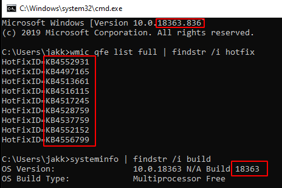
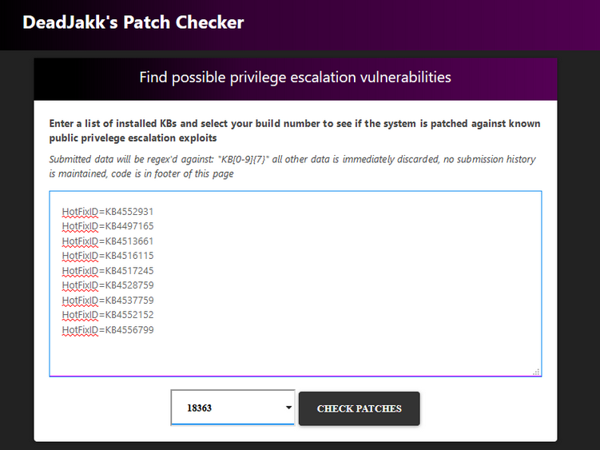
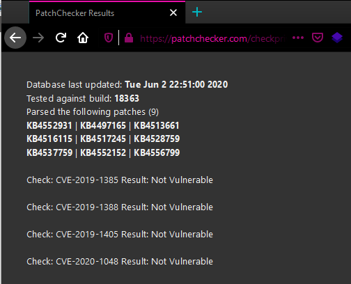
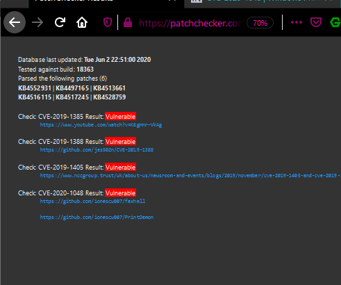

# PatchChecker
---
This is the code base for the service that runs on the following site: https://patchchecker.com.
In short, PatchChecker is a web application (running on flask) that provides output similar to that of [Watson](https://github.com/rasta-mouse/Watson/). However by using PatchChecker, one is not required to execute a binary on the target machine.
Included in this project is also a web scraper that will automatically update the database for PatchChecker using information present on Microsoft sites, this allows for a more scalable and easier to use solution to the problem of finding CVEs to which a Windows system is (or is not) patched against. 
Additionally, any other CVEs can be added to the data collector input and checked for as long as they have an entry on https://portal.msrc.microsoft.com.

Further information about this project can be found [here](http://shell.rip/URLHERE) or [here (github.io mirror)](https://deadjakk.github.io/URLHERE).


## Using PatchChecker to check vulnerabilities:
---
To use the patchchecker, you can either go to the publicly hosted website [here at patchchecker.com](https://patchchecker.com) or you can git clone this repo, install the required libraries, makes sure patches.db is in the same directory as app.py and then start the application with `python3 ./app.py`. 
Once the application is started you can open the included "index.html" file in a browser to actually use the service and get the list of patches to which the system being tested is vulnerable.   
Additional information can be found [here](https://deadjakk.github.io/URLHERE).

### Getting KB data:


### Expected input:


### Expected output from webpage:


### Expected output from webpage when vulnerabilities are found:


Alternatively, you can use a curl command and do something like this:
Request:   
note: you can use any delimiter you wish, i'm using spaces here:
```
curl 'https://patchchecker.com/checkprivs/' --data-raw 'wmicinfo=KB1231411 KB1231441 KB1234141&build_num=17763'
```
Response:   
*note: used some fake KBs so it's showing vuln to everything, i.e. I have nothing installed*  
*note: output is trunctated*    
```
{
    "total_vuln": 9,
    "kbs_parsed": [
        "KB1231411",
        "KB1231441",
        "KB1234141"
    ],
    "total_kbs_parsed": 3,
    "build": "17763",
    "results": [
        {
            "refs": [
                "https://exploit-db.com/exploits/46718",
                "https://decoder.cloud/2019/04/29/combinig-luafv-postluafvpostreadwrite-race-condition-pe-with-diaghub-collector-exploit-from-standard-user-to-system/"
            ],
            "name": "CVE-2019-0836",
            "vulnerable": true
        }
		]
}

```

## Data Collection: patchdata_collector.py
---
The `patchdata_collector.py` script is the pyppeteer scraper that iterates through several Microsoft sites to get the desired data for the cves specified in the `--cve-list` arg file.
For an example of the expected format see the `cves.txt` file within the `samples` directory. Basically it's a line-separated file with each line containing the following `CVE-XXXX-XXXX|https://website.com/resource-pertaining-to-CVE,http://second_resource.com`
you get the idea. An example of the resulting output can be found in the patches.db file included.  
The code isn't perfect but it gets the data and works for the time being. As refernce, with 9 CVEs, it should take about 11 minutes to complete, YMMV.

### patchdata_collector.py usage:
```
usage: patchdata_collector.py [-h] --cve-list CVE_LIST [--db DB] [--new-db] [-v]
                          [-vv] [--no-headless] [--json JSON]

optional arguments:
  -h, --help           show this help message and exit
  --cve-list CVE_LIST  line and pipe separated list containing CVEs and
                       related-URLs with information example: CVE-2020-1048|https://github.com/ionescu007/faxhell,https://github.com/ionescu007/PrintDemon
  --db DB              sqlite database filename
  --new-db             erases old database (if exists)
  -v                   set output to debug (verbose)
  -vv                  set output to annoying
  --no-headless        run browser with headless mode disabled
  --json JSON          json format output, argument should be json filename
```

### Example run:

Running `time ./patchdata_collector.py --cve-list cves.txt  --db antest.db --new-db` yields the following output:
```
2020-06-05 20:38:49.292 | INFO     | __main__:main:181 - Loaded 10 CVEs
2020-06-05 20:38:49.430 | INFO     | __main__:parsekb:33 - Parsing KBs for: CVE-2019-0836
2020-06-05 20:40:27.183 | INFO     | __main__:parsekb:33 - Parsing KBs for: CVE-2019-1064
2020-06-05 20:41:07.158 | INFO     | __main__:parsekb:33 - Parsing KBs for: CVE-2019-0841
2020-06-05 20:41:31.675 | INFO     | __main__:parsekb:33 - Parsing KBs for: CVE-2019-1130
2020-06-05 20:42:58.527 | INFO     | __main__:parsekb:33 - Parsing KBs for: CVE-2019-1253
2020-06-05 20:43:25.069 | INFO     | __main__:parsekb:33 - Parsing KBs for: CVE-2019-1315
2020-06-05 20:44:57.974 | INFO     | __main__:parsekb:33 - Parsing KBs for: CVE-2019-1385
2020-06-05 20:45:22.026 | INFO     | __main__:parsekb:33 - Parsing KBs for: CVE-2019-1388
2020-06-05 20:46:48.407 | INFO     | __main__:parsekb:33 - Parsing KBs for: CVE-2019-1405
2020-06-05 20:48:07.026 | INFO     | __main__:parsekb:33 - Parsing KBs for: CVE-2020-1048
finished

real	11m27.793s
user	1m21.632s
sys	0m14.559s
```
